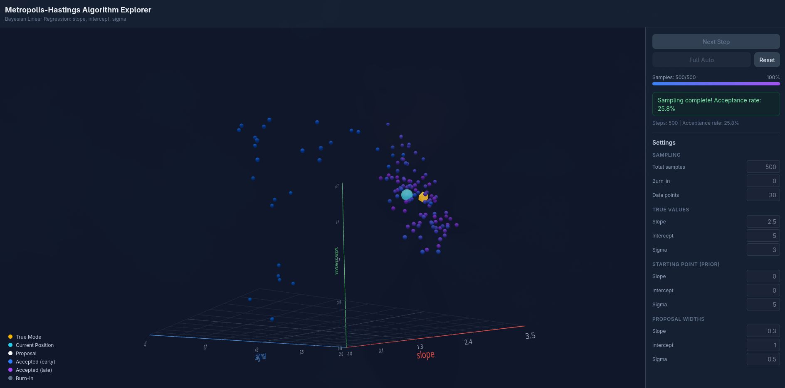

# Metropolis-Hastings Linear Regression

An interactive 3D visualization of the Metropolis-Hastings algorithm applied to Bayesian linear regression. Watch the posterior distribution being constructed one sample at a time, see proposals accepted or rejected, and observe the chain converge to the true mode.



## What it does

The app fits a Bayesian linear regression model with three parameters — **slope**, **intercept**, and **sigma** (noise standard deviation) — using the Metropolis-Hastings MCMC algorithm. You start from a deliberately wrong initial guess and watch the chain explore parameter space until it finds the region of highest posterior density.

**Step-by-step mode** lets you see each proposal individually:

1. A white proposal point appears with a line connecting it to the current position
2. The control panel shows the log posterior ratio and acceptance probability
3. You click "Accept" — the algorithm rolls the dice and the proposal is either accepted (green) or rejected (red)
4. Repeat

**Full-auto mode** runs ~5 samples per frame until the target count is reached.

## Getting started

```bash
npm install
npm run dev
```

Open http://localhost:5173 in your browser.

## Controls

| Control | Action |
|---------|--------|
| **Next Step** | Generate a proposal and display it |
| **Accept (X%)** | Run the accept/reject decision |
| **Full Auto** | Run all remaining samples automatically |
| **Stop** | Pause auto mode |
| **Reset** | Generate new data and restart from scratch |
| **Click + drag** | Rotate the 3D view |
| **Scroll** | Zoom in/out |
| **Right-click + drag** | Pan |

All parameter inputs (true values, starting point, proposal widths, sample counts) are editable when the algorithm is idle.

## 3D scene legend

| Marker | Meaning |
|--------|---------|
| Gold octahedron | True parameter values |
| Cyan sphere | Current chain position |
| White sphere + line | Pending proposal |
| Blue dots | Accepted samples (early) |
| Purple dots | Accepted samples (late) |
| Gray dots | Burn-in samples |

The blue-to-purple gradient reflects sampling order, making it easy to see how the chain migrates over time.

## Statistical model

- **Data**: `y_i = slope * x_i + intercept + Normal(0, sigma)` with `x_i ~ Uniform(0, 10)`
- **Likelihood**: Normal log-likelihood, computed entirely in log-space
- **Priors**: independent normals centered at the **Prior Belief** settings (std devs fixed at 10 for slope, 20 for intercept, 10 for sigma), with sigma constrained to `(0.01, 50]`
- **Proposal**: Symmetric normal perturbation with configurable widths per parameter
- **Acceptance**: `alpha = min(1, exp(log_posterior_proposed - log_posterior_current))`

## Project structure

```
src/
  engine/                  # Pure math, zero React imports
    random.ts              # Box-Muller normal sampling
    data-generator.ts      # Synthetic observed data
    model.ts               # logLikelihood, logPrior, logPosterior
    metropolis.ts          # propose, acceptanceProbability, step

  state/                   # State management
    types.ts               # State shape and action types
    algorithm-state.ts     # useReducer state machine

  scene/                   # 3D visualization (react-three-fiber)
    SceneRoot.tsx           # Canvas, camera, lighting, OrbitControls
    PointCloud.tsx          # InstancedMesh for sample points
    TrueMode.tsx            # Gold marker at true values
    CurrentHypothesis.tsx   # Cyan pulsing sphere
    ProposalPoint.tsx       # White sphere + connecting line
    AxisSystem.tsx          # 3D axes, grid, tick labels
    Legend.tsx              # Overlay legend

  ui/                      # Control panel
    ControlPanel.tsx        # Container
    StepControls.tsx        # Action buttons
    ParameterInputs.tsx     # Numeric input fields
    StatusDisplay.tsx       # Status messages + acceptance rate
    ProgressBar.tsx         # Sampling progress
```

## Built with

- [React](https://react.dev) + [TypeScript](https://www.typescriptlang.org) + [Vite](https://vite.dev)
- [react-three-fiber](https://r3f.docs.pmnd.rs) + [@react-three/drei](https://drei.docs.pmnd.rs) for declarative 3D
- [Tailwind CSS v4](https://tailwindcss.com) for styling

## License

[MIT](LICENSE)
